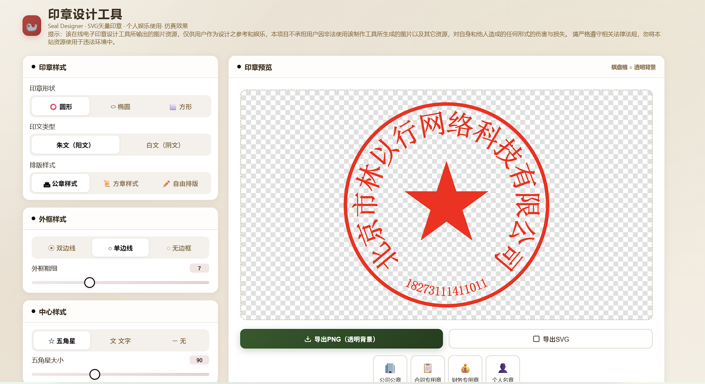
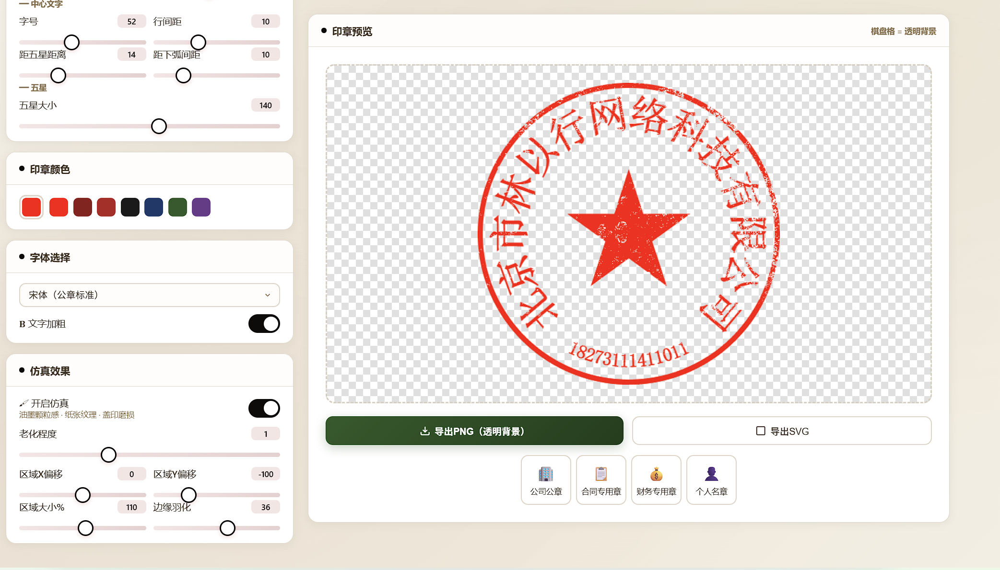

# Seal Designer — SVG 印章在线设计工具

纯前端 SVG 矢量印章在线生成器，支持公章、方章、自由排版等多种样式，带仿真老化效果，无需后端服务。

## 预览


*公章样式（朱文/阳文），带仿真老化效果*


*方章样式及椭圆印章，多种排版和颜色*

## 功能

- **印章形状**：圆形、椭圆形、方形
- **印章类型**：朱文（阳文，红底白字）、白文（阴文，白底红字）
- **排版样式**：
  - 公章样式 — 上弧文字 + 下弧文字 + 中心五角星/文字
  - 方章样式 — 横排/竖排文字排列
  - 自由排版 — 自定义行数、行距
- **边框样式**：单边、双边（可调间距）、无边
- **中心元素**：五角星、自定义符号、无
- **文字参数**：字号、字间距、弧度、边距、行距
- **颜色系统**：预设色板 + 取色器，支持朱红、暗红、黑、藏蓝、墨绿等
- **字体选择**：宋体（公章标准）、黑体、楷体、仿宋、隶书
- **仿真效果**：油墨颗粒感 + 纸张纹理 + 盖印磨损老化（可调程度/区域/位置/羽化）
- **快速预设**：公司公章、合同专用章、财务专用章、个人名章
- **导出格式**：PNG 透明背景（3x 高清）、SVG 矢量

## 运行方式

直接用浏览器打开 `seal-designer.html` 即可，不需要安装任何东西。

```bash
# 克隆仓库
git clone https://github.com/lyhzs/seal-designer.git
cd seal-designer

# 直接双击或用浏览器打开
start seal-designer.html
```

因为文件需加载 `sealNoisy.png` 纹理资源，建议在**文件系统**中直接打开，部分浏览器在 `file://` 协议下可以正常加载本地资源。

## 项目结构

```
seal-designer/
├── seal-designer.html    # 主应用（HTML + CSS + JavaScript 全功能单文件）
├── sealNoisy.png         # 噪点纹理图（盖印磨损老化效果）
├── 1.png                 # 预览截图
├── 2.png                 # 预览截图
└── README.md
```

## 特点

- **纯前端**：一个 HTML 文件搞定，无框架、无依赖、无需服务器
- **实时预览**：左侧参数调整，右侧即时渲染
- **视觉一致**：预览和导出的老化效果使用同一套纹理方案，所见即所得
- **参数丰富**：字形、弧线、间距、位置、颜色全部可调
- **单文件架构**：所有逻辑在单个 HTML 中，便于分享和单机使用

## Tech Stack

Pure HTML + CSS + JavaScript (Canvas 2D + SVG). Zero dependencies.

